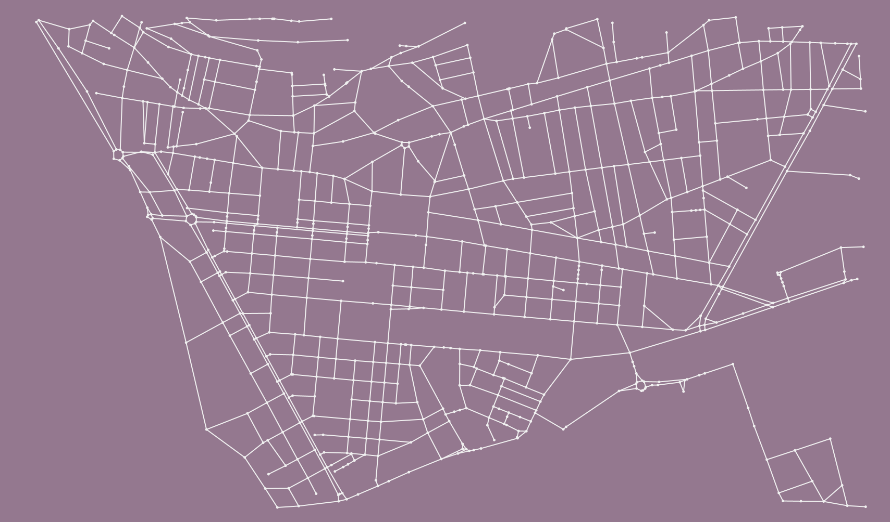
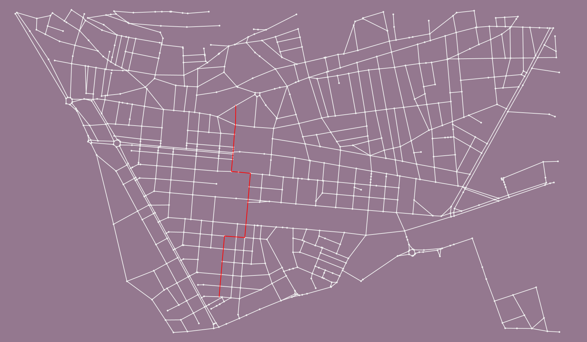
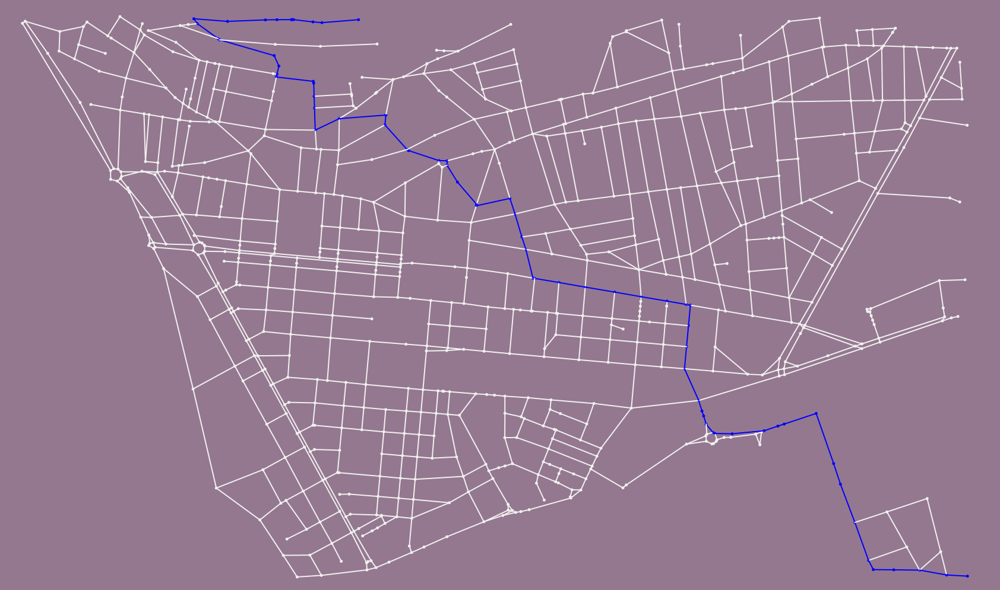
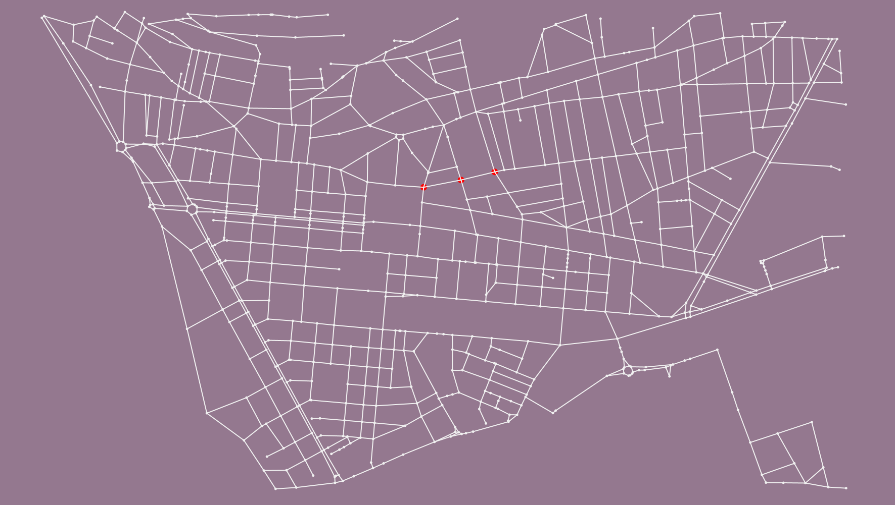
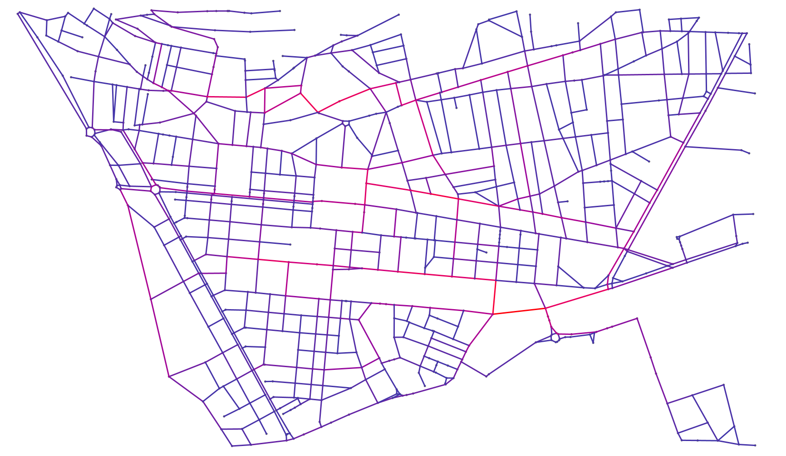

# Plus courts chemins


- Année : M1 iWOCS
- Matière: Graphe

## Auteur(s)

|Nom|Prénom|login|email|
|--|--|--|--|
| *KOUTO* | *Dosseh* | *dosseh* | *dossehkouto@yahoo.fr* |


### 1 )    
 ####  Affichage du graphe :





- ***Il s’agit de la ville du Havre*** .

### 2 )  

- Nombre de sommets = 761
- Nombre d’arêtes = 1106
- Degré moyen = 2.9067018032073975
-  Distribution de degrés : 
  
		1     0.04204993429697766 
 
		2     0.24178712220762155 
 
		3     0.4940867279894875 
 
		4     0.21287779237844942 
 
		5     0.00788436268068331 
 
		6     0.001314060446780552 


- Coefficient de clustering : 0.02220762155059133.
- Oui à mon avis, on retrouve des valeurs similaires pour tout réseau routier.

### 3 )  

 ####  Méthode permettant de trouver le plus court chemin entre deux sommets en utilisant l’algorithme de Dijkstra
```java 
public static void dikstraPlusCourt_chemin(Graph graph, Node sommet1, Node sommet2) {  
  
    Dijkstra dijkstra = new Dijkstra(EDGE, "result", "length");  
  
  dijkstra.init(graph);  
  dijkstra.setSource(graph.getNode(String.valueOf(sommet1)));  
  dijkstra.compute();  
  //System.out.println(dijkstra.getPath(graph.getNode(String.valueOf(sommet2))));  
  
  System.out.printf("%s->%s:%6.2f%n", dijkstra.getSource(), sommet2, dijkstra.getPathLength(sommet2));  
  for (Edge edge : dijkstra.getPathEdges(sommet2)) edge.addAttribute("ui.style", "fill-color: red;");  
 
}
```

 ####  Test avec un sommet choisi au hasard
J'ai créé une méthode permettant de choisis au hasard un nœud d'un graphe passé en paramètre.

```java 
public static Node randomNode(Graph graph) {  
    return Toolkit.randomNode(graph);  
}
```
- Test

```java 
dikstraPlusCourt_chemin(graph, randomNode(graph), randomNode(graph));
```

-  Visualiser du chemin en changeant la couleur des arêtes.



   Le plus court chemin est colorié en rouge.

### 4 )  

-   (_Facultatif_)

### 5 )  

 #### 1- Méthode permettant de calculer le diamètre avec l'algorithme de Dijkstra:  

```java 
public static void diametre_Dijkstra(Graph graph) {  
  
    long startTime = System.currentTimeMillis();  
  
  ArrayList<Double> stockLongueur = new ArrayList<>();  
  Dijkstra dijkstra = new Dijkstra(EDGE, "result", "length");  
  dijkstra.init(graph);  
  Node source = null;  
  Node destination = null;  
  double longSet = 0;  
  double j = 0;  
  
 for (Node n : graph.getEachNode()) {  
        dijkstra.setSource(n);  
  dijkstra.compute();  
  
  
 for (Node n2 : graph.getEachNode()) {  
            double longActu = dijkstra.getPathLength(n2);  
 if (longActu > longSet) {  
                longSet = longActu;  
  source = n;  
  destination = n2;  
  }  
            stockLongueur.add(dijkstra.getPathLength(n2));  
  
  }  
        // determination de distance moyenne  
  }  
  
    System.out.println("\nDiametre de dijkstra: " + longSet);  
  
 long stopTime = System.currentTimeMillis();  
 long elapsedTime = stopTime - startTime;  
  System.out.println("Le temps d'execution de dijkstra : " + elapsedTime);  
  
  dijkstra.setSource(source);  
  dijkstra.compute();  
 for (Node node : dijkstra.getPathNodes(destination)) node.addAttribute("ui.style", "fill-color: blue;");  
 for (Edge edge : dijkstra.getPathEdges(destination)) edge.addAttribute("ui.style", "fill-color: blue;");  
  
  
 for (int k = 0; k < stockLongueur.size(); k++) {  
        j += stockLongueur.get(k) / stockLongueur.size();  
  }  
    System.out.println("La distance moyenne :" + j);  
  
} 
}
```

 #### 2- Méthode permettant de calculer le diamètre avec l'algorithme de Floyd-Warshall : 
 
 
```java 
public static void diametre_FloydWarshall(Graph g) {  
    long startTime = System.currentTimeMillis();  
  
  Path path = null;  
 double longSet = 0;  
  
  APSP apsp = new APSP();  
  apsp.init(g);  
  apsp.setDirected(false);  
  apsp.setWeightAttributeName("length");  
  apsp.compute();  
  
 for (Node n : g.getEachNode()) {  
        APSPInfo info = n.getAttribute(APSPInfo.ATTRIBUTE_NAME);  
  
 for (Node n2 : g.getEachNode()) {  
            Path p = info.getShortestPathTo(n2.getId());  
 double longActu = p.getPathWeight("length");  
  
 if (longActu > longSet) {  
                longSet = longActu;  
  path = p;  
  }  
        }  
    }  
  
    System.out.println("\nDiametre de Floyd Warshall: " + longSet);  
  
 long stopTime = System.currentTimeMillis();  
 long elapsedTime = stopTime - startTime;  
  System.out.println("Le temps d'execution de Floyd Warshall : " + elapsedTime);  
  
 for (Node node : path.getNodePath())  
        node.addAttribute("ui.style", "fill-color: blue;");  
  
 for (Edge edge : path.getEdgePath())  
        edge.addAttribute("ui.style", "fill-color: blue;");  
  
}
```


-  Visualiser du diamètre avec une couleur bleue.





- ***Le diamètre  = 4232.146270000001***

### 6 )  

L'algorithme de Dijkstra est plus efficace pour notre graphe car sa complexité  est **O(m * n ln n)**  tandis que  la complexité de  l'algorithme de Floyd-Warshall est  **O(n^3 )** .


### 7 )  

 - Pour mesuré le temps d'execution j'ai utilisé la methode ***currentTimeMillis***. Vous pouvez le remarqué dans les deux méthodes (***diametre_Dijkstra*** et ***diametre_FloydWarshall***) implémenté si déçu.

- Le temps d’exécution de dijkstra =  860 millisecondes
- Le temps d’exécution de Floyd Warshall =  47923 millisecondes

- Non la réalité ne correspond à nos prévisions théoriques.


## Pour aller plus loin  

 #### Calcul de la distance moyenne : 
 
J'ai implémenté le calcul de distance moyenne dans la méthode  ***diametre_Dijkstra***.
- Si je dois aller de point A à point B dans ma ville, la distance en moyenne que je dois parcourir est : 1341.3492176499828.

 #### Le centre de notre ville :
 
- Voici la methode permettant de determiner le centre de notre ville.

```java
public static void centre(Graph graph) {  
    APSP apsp = new APSP();  
  apsp.init(graph);  
  apsp.compute();  
  
  Eccentricity eccentricity = new Eccentricity();  
  eccentricity.init(graph);  
  eccentricity.compute();  
  
 for (Node n : graph.getEachNode()) {  
        Boolean in = n.getAttribute("eccentricity");  
  
 if (in) {  
            System.out.printf("%s est en excentricité.\n", n.getId());  
  n.setAttribute("ui.style", "fill-color: red;size: 13px;");  
  }  
  
 }  
 
}
```

- Concernant le centre , on a plusieurs sommets d'excentricité minimale (sommets centroïde) qui sont :

		33229191 
		33229193
		33294613  
C'est entre ces trois sommets où se trouve le centre de notre ville.
- Visualisation des sommets _centroïde_ représenté par la couleur rouge: 



 #### la centralité intermédiaire ou intermédiarité (betweenness centrality) :
 
- Voici la méthode permettant de déterminer l'intermédiarité.
```java
public static void betweenness_centrality(Graph graph) {  
  
    ArrayList<Double> arrayList = new ArrayList<>();  
  
  BetweennessCentrality bcb = new BetweennessCentrality();  
  bcb.setWeightAttributeName("weight");  
  bcb.init(graph);  
  bcb.compute();  
  
  // Le  gradient de couleur va du bleu (Intermediarité le moins chargé) vers le rouge (intermediarité le plus chargée) 
  
  graph.addAttribute("ui.stylesheet", "edge {" +  
            "fill-mode: dyn-plain; fill-color:#4137aa," +  
            " #99089e, #d4007c, #f7004c, #ff0000;size : 3px;" +  
            "}" +  
            "node {\n" +  
            "        size: 5px;\n" +  
            "        fill-color: #777;\n" +  
            "        z-index: 0;\n" +  
            "    }");  
  
 for (Node n : graph.getEachNode()) {  
        Iterator<? extends Node> k = n.getNeighborNodeIterator();  
 while (k.hasNext()) {  
            Node next = k.next();  
  Edge edge = n.getEdgeBetween(next);  
  edge.addAttribute("ui.color", (((Double) edge.getAttribute("Cb") * 0.00001)));  
  //  System.out.println(((Double) edge.getAttribute("Cb") * 0.00001));  
  
  arrayList.add((Double) edge.getAttribute("Cb"));  
  
  }  
 }  
}
```
 
 - Visualisation des intermédiarités: 



Le  gradient de couleur va du bleu (Intermediarité le moins chargé) vers le rouge (intermediarité le plus chargée).

- Oui on retrouve les axes le plus chargés de trafic. Ce sont les axes coloriés au rouge.


## 
### KOUTO Dosseh
### M1 IWOCS
### [dosseh.kouto@etu.univ-lehavre.fr](https://ent.normandie-univ.fr/uPortal/f/u19824l1s547/p/messagerie-lehavre.u19824l1n897/max/render.uP?pCp)
## 

